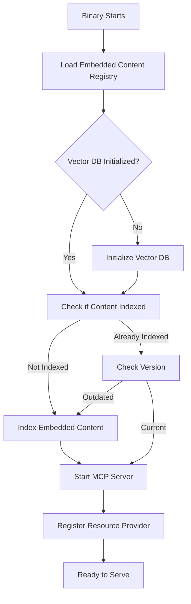

# Embedded Content Architecture Design

## Executive Summary

This document outlines the design for embedding static content (initially the justfile best practices document) directly into the just-mcp binary. The embedded content will be automatically indexed in the vector database on startup and exposed as MCP Resources.

### Key Goals

1. **Zero-configuration deployment**: Content is available immediately without external files
2. **Semantic searchability**: Embedded content is automatically indexed for vector search
3. **MCP accessibility**: Content is exposed through the Model Context Protocol as Resources
4. **Maintainability**: Easy to update and add new embedded documents
5. **Performance**: Minimal runtime overhead with compile-time embedding

## Current State Analysis

### Vector Search Architecture

The current vector search implementation provides:

- **VectorSearchManager**: High-level interface for document indexing and search
- **LibSqlVectorStore**: SQLite-based vector storage with tables for documents, metadata, and embeddings
- **LocalEmbeddingProvider**: Offline embedding generation using sentence-transformers
- **Document Structure**: Includes id, content, source_path, justfile_name, task_name, and flexible metadata

### MCP Server Status

Currently, the MCP server implements:

- Tools API (tools/list, tools/call)
- Notifications (tools/list_changed)
- **Resources API** - will be added to support embedded content access
- **Resource Templates** - will be added to support dynamic resource discovery
- **Completion API** - will be added to support auto-completion of resource arguments

### Embedding Options in Rust

Modern Rust provides several approaches for embedding static content:

1. **`include_str!` macro**: Embeds UTF-8 text at compile time
2. **`include_bytes!` macro**: Embeds binary data at compile time
3. **`rust-embed` crate**: More sophisticated asset embedding with compression
4. **Build scripts (build.rs)**: Generate Rust code from external files

## Architecture Design

### Module Structure

```
src/
├── embedded_content/
│   ├── mod.rs          # Public API and registry
│   ├── documents.rs    # Embedded document definitions
│   ├── indexer.rs      # Auto-indexing logic
│   └── resources.rs    # MCP Resource representations
├── server/
│   ├── mod.rs          # Extended with Resource support
│   ├── handler.rs      # Add resource method handlers
│   └── resources.rs    # MCP Resource protocol implementation
└── main.rs             # Initialize embedded content on startup
```

### Component Responsibilities

#### 1. Embedded Content Module (`src/embedded_content/`)

**Core Registry (`mod.rs`)**:

```rust
pub struct EmbeddedContentRegistry {
    documents: Vec<EmbeddedDocument>,
}

impl EmbeddedContentRegistry {
    pub fn new() -> Self;
    pub fn get_all_documents(&self) -> &[EmbeddedDocument];
    pub fn get_document_by_id(&self, id: &str) -> Option<&EmbeddedDocument>;
    pub fn get_documents_by_tag(&self, tag: &str) -> Vec<&EmbeddedDocument>;
}
```

**Document Definitions (`documents.rs`)**:

```rust
pub struct EmbeddedDocument {
    pub id: String,
    pub title: String,
    pub description: String,
    pub content: &'static str,
    pub content_type: String,
    pub tags: Vec<String>,
    pub metadata: HashMap<String, String>,
}

// Compile-time embedding
pub static JUSTFILE_BEST_PRACTICES: &str = include_str!("../../../assets/docs/JUSTFILE_BEST_PRACTICES.md");

pub fn create_embedded_documents() -> Vec<EmbeddedDocument> {
    vec![
        EmbeddedDocument {
            id: "justfile-best-practices".to_string(),
            title: "Best Practices for Modular Justfiles".to_string(),
            description: "Comprehensive guide for creating maintainable justfile structures".to_string(),
            content: JUSTFILE_BEST_PRACTICES,
            content_type: "text/markdown".to_string(),
            tags: vec!["justfile", "best-practices", "documentation", "guide"],
            metadata: HashMap::from([
                ("version", "1.0"),
                ("author", "just-mcp team"),
                ("embedded", "true"),
            ]),
        },
    ]
}
```

**Auto-Indexing (`indexer.rs`)**:

```rust
pub struct EmbeddedContentIndexer {
    vector_manager: Arc<Mutex<VectorSearchManager>>,
}

impl EmbeddedContentIndexer {
    pub async fn new(vector_manager: Arc<Mutex<VectorSearchManager>>) -> Self;
    
    pub async fn index_embedded_content(&self) -> Result<()> {
        // Check if already indexed using metadata query
        // Index each embedded document with special ID prefix
        // Store indexing timestamp in metadata
    }
    
    pub async fn is_content_indexed(&self) -> Result<bool>;
    pub async fn reindex_content(&self, force: bool) -> Result<()>;
}
```

#### 2. MCP Resources Implementation (`src/server/resources.rs`)

```rust
#[derive(Debug, Clone, Serialize, Deserialize)]
pub struct Resource {
    pub uri: String,
    pub name: String,
    pub title: Option<String>,
    pub description: Option<String>,
    #[serde(rename = "mimeType")]
    pub mime_type: Option<String>,
    pub size: Option<u64>,
}

#[derive(Debug, Clone, Serialize, Deserialize)]
pub struct ResourceContent {
    pub uri: String,
    pub text: Option<String>,
    pub blob: Option<String>, // base64-encoded binary data
    #[serde(rename = "mimeType")]
    pub mime_type: Option<String>,
}

pub trait ResourceProvider: Send + Sync {
    async fn list_resources(&self) -> Result<Vec<Resource>>;
    async fn read_resource(&self, uri: &str) -> Result<ResourceContent>;
    async fn list_resource_templates(&self) -> Result<Vec<ResourceTemplate>>;
    async fn complete_resource(&self, request: &CompletionRequest) -> Result<CompletionResult>;
}

pub struct EmbeddedResourceProvider {
    registry: Arc<EmbeddedContentRegistry>,
}

impl ResourceProvider for EmbeddedResourceProvider {
    async fn list_resources(&self) -> Result<Vec<Resource>> {
        let resources = self.registry.get_all_documents()
            .iter()
            .map(|doc| Resource {
                uri: format!("file:///docs/guides/{}.md", doc.id),
                name: format!("{}.md", doc.id),
                title: Some(doc.title.clone()),
                description: Some(doc.description.clone()),
                mime_type: Some(doc.content_type.clone()),
                size: Some(doc.content.len() as u64),
            })
            .collect();
        Ok(resources)
    }
    
    async fn read_resource(&self, uri: &str) -> Result<ResourceContent> {
        // Extract document ID from file:///docs/guides/{id}.md URI pattern
        let doc_id = uri.strip_prefix("file:///docs/guides/")
            .and_then(|s| s.strip_suffix(".md"))
            .ok_or_else(|| anyhow::anyhow!("Invalid embedded resource URI: {}", uri))?;
            
        let document = self.registry.get_document_by_id(doc_id)
            .ok_or_else(|| anyhow::anyhow!("Document not found: {}", doc_id))?;
            
        Ok(ResourceContent {
            uri: uri.to_string(),
            text: Some(document.content.to_string()),
            blob: None,
            mime_type: Some(document.content_type.clone()),
        })
    }
    
    async fn list_resource_templates(&self) -> Result<Vec<ResourceTemplate>> {
        Ok(Self::create_resource_templates())
    }
    
    async fn complete_resource(&self, request: &CompletionRequest) -> Result<CompletionResult> {
        // Implementation shown in Resource Templates section above
        todo!("Implement completion logic")
    }
}
```

### Initialization Flow



## Implementation Details

### 1. Document Identification

- Use URI scheme: `file:///docs/guides/[document-name].md`
- Document IDs are prefixed in vector DB: `embedded::[document-id]`
- Example: `file:///docs/guides/justfile-best-practices.md` maps to document ID `embedded::justfile-best-practices`

### 2. Indexing Strategy

```rust
// Chunking strategy for large documents
pub struct DocumentChunker {
    chunk_size: usize,        // e.g., 1000 characters
    chunk_overlap: usize,     // e.g., 200 characters
}

// Index as both full document and chunks
async fn index_document(doc: &EmbeddedDocument) -> Result<()> {
    // 1. Index full document with metadata
    // 2. Split into semantic chunks (by sections/paragraphs)
    // 3. Index each chunk with reference to parent
}
```

### 3. Metadata Schema

```json
{
  "document_id": "embedded::justfile-best-practices",
  "type": "embedded_document",
  "source": "compile_time",
  "indexed_at": "2025-01-15T10:30:00Z",
  "version": "1.0",
  "parent_id": null,
  "chunk_index": null,
  "tags": ["justfile", "best-practices", "documentation"]
}
```

### 4. MCP Protocol Extensions

**Resources List Response**:

```json
{
  "jsonrpc": "2.0",
  "id": 1,
  "result": {
    "resources": [
      {
        "uri": "file:///docs/guides/justfile-best-practices.md",
        "name": "justfile-best-practices.md",
        "title": "Justfile Best Practices Guide",
        "description": "Comprehensive guide for creating maintainable justfile structures",
        "mimeType": "text/markdown"
      }
    ]
  }
}
```

**Resource Read Response**:

```json
{
  "jsonrpc": "2.0",
  "id": 2,
  "result": {
    "contents": [
      {
        "uri": "file:///docs/guides/justfile-best-practices.md",
        "text": "# Best Practices for Modular Justfiles...",
        "mimeType": "text/markdown"
      }
    ]
  }
}
```

## Resource Templates Implementation

### Overview

Resource Templates allow dynamic resource discovery through parameterized URIs using RFC6570 URI templates. This enables AI assistants to auto-complete resource arguments and discover available resources based on patterns.

### Template Structure

```rust
#[derive(Debug, Clone, Serialize, Deserialize)]
pub struct ResourceTemplate {
    #[serde(rename = "uriTemplate")]
    pub uri_template: String,
    pub name: String,
    pub title: Option<String>,
    pub description: Option<String>,
    #[serde(rename = "mimeType")]
    pub mime_type: Option<String>,
}

#[derive(Debug, Clone, Serialize, Deserialize)]
pub struct CompletionRequest {
    pub ref_: String,
    pub argument: CompletionArgument,
}

#[derive(Debug, Clone, Serialize, Deserialize)]
pub struct CompletionArgument {
    pub name: String,
    pub value: String,
}

#[derive(Debug, Clone, Serialize, Deserialize)]
pub struct CompletionResult {
    pub completion: Completion,
}

#[derive(Debug, Clone, Serialize, Deserialize)]
pub struct Completion {
    pub values: Vec<CompletionValue>,
    #[serde(skip_serializing_if = "Option::is_none")]
    pub total: Option<u32>,
    #[serde(skip_serializing_if = "Option::is_none")]
    pub has_more: Option<bool>,
}

#[derive(Debug, Clone, Serialize, Deserialize)]
pub struct CompletionValue {
    pub value: String,
    #[serde(skip_serializing_if = "Option::is_none")]
    pub label: Option<String>,
    #[serde(skip_serializing_if = "Option::is_none")]
    pub description: Option<String>,
}
```

### Best-Practice Guides Template

For our embedded content, we'll implement a "Best-Practice Guides" category template:

```rust
impl EmbeddedResourceProvider {
    fn create_resource_templates() -> Vec<ResourceTemplate> {
        vec![
            ResourceTemplate {
                uri_template: "file:///docs/guides/{guide}.md".to_string(),
                name: "best-practice-guides".to_string(),
                title: Some("Best-Practice Guides".to_string()),
                description: Some("Documentation guides for best practices and patterns".to_string()),
                mime_type: Some("text/markdown".to_string()),
            },
        ]
    }
    
    async fn list_resource_templates(&self) -> Result<Vec<ResourceTemplate>> {
        Ok(Self::create_resource_templates())
    }
}
```

### Completion API Implementation

```rust
impl EmbeddedResourceProvider {
    async fn complete_resource(&self, request: &CompletionRequest) -> Result<CompletionResult> {
        let template_name = extract_template_name(&request.ref_)?;
        
        match template_name.as_str() {
            "best-practice-guides" => {
                self.complete_guide_names(&request.argument).await
            }
            _ => Ok(CompletionResult {
                completion: Completion {
                    values: vec![],
                    total: Some(0),
                    has_more: Some(false),
                }
            })
        }
    }
    
    async fn complete_guide_names(&self, argument: &CompletionArgument) -> Result<CompletionResult> {
        if argument.name != "guide" {
            return Ok(CompletionResult {
                completion: Completion {
                    values: vec![],
                    total: Some(0),
                    has_more: Some(false),
                }
            });
        }
        
        let guides = self.registry.get_documents_by_tag("guide");
        let prefix = argument.value.to_lowercase();
        
        let matching_guides: Vec<CompletionValue> = guides
            .iter()
            .filter(|doc| doc.id.to_lowercase().starts_with(&prefix))
            .map(|doc| CompletionValue {
                value: doc.id.clone(),
                label: Some(doc.title.clone()),
                description: Some(doc.description.clone()),
            })
            .collect();
        
        Ok(CompletionResult {
            completion: Completion {
                values: matching_guides,
                total: Some(guides.len() as u32),
                has_more: Some(false),
            }
        })
    }
}

fn extract_template_name(ref_str: &str) -> Result<String> {
    // Parse "resources/templates/<template-name>" format
    let parts: Vec<&str> = ref_str.split('/').collect();
    if parts.len() >= 3 && parts[0] == "resources" && parts[1] == "templates" {
        Ok(parts[2].to_string())
    } else {
        Err(anyhow::anyhow!("Invalid template reference: {}", ref_str))
    }
}
```

### Protocol Examples

**Resource Templates List Request/Response**:

```json
{
  "jsonrpc": "2.0",
  "method": "resources/templates/list",
  "id": 1
}

{
  "jsonrpc": "2.0",
  "id": 1,
  "result": {
    "resourceTemplates": [
      {
        "uriTemplate": "file:///docs/guides/{guide}.md",
        "name": "best-practice-guides",
        "title": "Best-Practice Guides",
        "description": "Documentation guides for best practices and patterns",
        "mimeType": "text/markdown"
      }
    ]
  }
}
```

**Completion Request/Response**:

```json
{
  "jsonrpc": "2.0",
  "method": "completion/complete",
  "id": 2,
  "params": {
    "ref": "resources/templates/best-practice-guides",
    "argument": {
      "name": "guide",
      "value": "just"
    }
  }
}

{
  "jsonrpc": "2.0",
  "id": 2,
  "result": {
    "completion": {
      "values": [
        {
          "value": "justfile-best-practices",
          "label": "Justfile Best Practices Guide",
          "description": "Comprehensive guide for creating maintainable justfile structures"
        }
      ],
      "total": 1,
      "hasMore": false
    }
  }
}
```

**Template-based Resource Access**:

```json
{
  "jsonrpc": "2.0",
  "method": "resources/read",
  "id": 3,
  "params": {
    "uri": "file:///docs/guides/justfile-best-practices.md"
  }
}
```

### MCP Server Integration

The server handler needs to support the new resource template methods:

```rust
// In src/server/handler.rs
impl McpServerHandler {
    async fn handle_request(&mut self, request: JsonRpcRequest) -> Result<JsonRpcResponse> {
        match request.method.as_str() {
            // ... existing methods ...
            "resources/list" => self.handle_resources_list(request.id).await,
            "resources/read" => self.handle_resources_read(request).await,
            "resources/templates/list" => self.handle_resource_templates_list(request.id).await,
            "completion/complete" => self.handle_completion(request).await,
            _ => Ok(create_error_response(request.id, -32601, "Method not found")),
        }
    }
    
    async fn handle_resource_templates_list(&self, id: JsonRpcId) -> Result<JsonRpcResponse> {
        let templates = self.resource_provider.list_resource_templates().await?;
        Ok(JsonRpcResponse {
            jsonrpc: "2.0".to_string(),
            id,
            result: Some(serde_json::json!({
                "resourceTemplates": templates
            })),
            error: None,
        })
    }
    
    async fn handle_completion(&self, request: JsonRpcRequest) -> Result<JsonRpcResponse> {
        let completion_request: CompletionRequest = serde_json::from_value(
            request.params.ok_or_else(|| anyhow::anyhow!("Missing params"))?
        )?;
        
        let result = self.resource_provider.complete_resource(&completion_request).await?;
        
        Ok(JsonRpcResponse {
            jsonrpc: "2.0".to_string(),
            id: request.id,
            result: Some(serde_json::to_value(result)?),
            error: None,
        })
    }
}
```

### Future Template Extensions

Additional resource templates can be added for:

1. **Example Justfiles**: `file:///docs/examples/{language}/{example}.just`
2. **Reference Documentation**: `file:///docs/reference/{section}.md`
3. **Templates**: `file:///docs/templates/{project-type}/justfile`

Each template would have its own completion logic based on available embedded content.

### Server Capabilities Declaration

The MCP server must declare its capabilities during initialization:

```json
{
  "jsonrpc": "2.0",
  "id": 1,
  "result": {
    "protocolVersion": "2024-11-05",
    "capabilities": {
      "tools": {
        "listChanged": true
      },
      "resources": {
        "subscribe": false,
        "listChanged": false
      },
      "resourceTemplates": {
        "listChanged": false
      },
      "completion": {
        "argument": true
      }
    },
    "serverInfo": {
      "name": "just-mcp",
      "version": "0.1.0"
    }
  }
}
```

The server initialization must include resource capability registration:

```rust
impl McpServerHandler {
    pub fn new(resource_provider: Arc<EmbeddedResourceProvider>) -> Self {
        Self {
            resource_provider,
            // ... other fields
        }
    }
    
    async fn handle_initialize(&mut self, params: serde_json::Value) -> Result<JsonRpcResponse> {
        // ... existing initialization logic ...
        
        let capabilities = serde_json::json!({
            "tools": {
                "listChanged": true
            },
            "resources": {
                "subscribe": false,
                "listChanged": false
            },
            "resourceTemplates": {
                "listChanged": false
            },
            "completion": {
                "argument": true
            }
        });
        
        // ... return response with capabilities
    }
}
```

## Performance Considerations

### Compile-Time Impact

- Each embedded document increases binary size by its content size
- JUSTFILE_BEST_PRACTICES.md is ~40KB, negligible for modern systems
- Compression not needed for text files this size

### Runtime Impact

- One-time indexing cost on first run (~100ms for 40KB document)
- Subsequent runs check metadata only (< 5ms)
- No file I/O required after compilation
- Memory usage: content stored once in static memory

### Binary Size Analysis

| Component | Size Impact |
|-----------|------------|
| Base just-mcp binary | ~15MB |
| Embedded markdown (40KB) | +40KB |
| Embedding vectors | +1.5KB per chunk |
| Total increase | ~50KB (<0.4%) |

## Scalability Considerations

### 1. Multiple Document Support

```rust
// Future: Dynamic document loading
pub trait DocumentSource {
    fn get_documents(&self) -> Vec<EmbeddedDocument>;
}

pub struct CompiledDocuments;
impl DocumentSource for CompiledDocuments { /* ... */ }

pub struct ExternalDocuments { path: PathBuf }
impl DocumentSource for ExternalDocuments { /* ... */ }
```

### 2. Feature Flags

```toml
[features]
embedded-docs = ["embedded-best-practices", "embedded-examples"]
embedded-best-practices = []
embedded-examples = []
```

### 3. Document Categories

Future documents can be organized by category:

- **Guides**: Best practices, tutorials
- **References**: API docs, command references
- **Examples**: Sample justfiles, patterns
- **Templates**: Starter justfiles for different languages

### 4. Versioning Strategy

```rust
pub struct DocumentVersion {
    major: u16,
    minor: u16,
    patch: u16,
    content_hash: String,
}

// Reindex if version changes
impl EmbeddedDocument {
    pub fn needs_reindex(&self, indexed_version: &DocumentVersion) -> bool {
        self.version != *indexed_version || 
        self.content_hash() != indexed_version.content_hash
    }
}
```

## Alternative Approaches Considered

### 1. Pre-populated Database Snapshot

**Pros**:

- No runtime indexing needed
- Faster initial startup

**Cons**:

- Database format compatibility issues
- Larger binary size (indices + data)
- Platform-specific database files
- Harder to update content

**Decision**: Rejected due to maintenance complexity

### 2. External Asset Files

**Pros**:

- Smaller binary size
- Easy to update without recompilation

**Cons**:

- Deployment complexity
- File path resolution issues
- Not truly embedded

**Decision**: Rejected as it doesn't meet the "zero-configuration" goal

### 3. Build Script Generation

**Pros**:

- More flexible preprocessing
- Can optimize content at build time

**Cons**:

- Increased build complexity
- Harder to maintain
- Less transparent

**Decision**: Not needed for current requirements

## Implementation Phases

### Phase 1: Core Implementation (Week 1)

1. Create embedded_content module structure
2. Implement document registry with single document
3. Add auto-indexing on startup
4. Test vector search integration

### Phase 2: MCP Resources (Week 2)

1. Implement MCP Resources protocol
2. Add resource provider interface
3. Integrate with MCP server handler
4. Test with MCP clients

### Phase 3: Polish & Extensions (Week 3)

1. Add reindexing logic for updates
2. Implement chunking for better search
3. Add metrics and logging
4. Documentation and examples

### Phase 4: Future Enhancements

1. Support for multiple embedded documents
2. Feature flags for conditional embedding
3. Compression for larger documents
4. Runtime document loading (hybrid approach)

## Testing Strategy

### Unit Tests

- Document registry operations
- Indexing logic with mock vector store
- Resource provider implementation
- URI parsing and validation
- Resource template creation and validation
- Completion logic for different argument types
- URI template expansion and validation

### Integration Tests

- Full indexing flow with real vector database
- MCP protocol compliance for resources/list and resources/read
- Resource template discovery and completion API
- Search functionality with embedded content
- Version change detection and reindexing
- End-to-end resource access via file:// URIs

### Performance Tests

- Binary size measurement
- Indexing time benchmarks
- Memory usage profiling
- Startup time impact

## Security Considerations

1. **Content Validation**: Embedded content is compile-time constant, eliminating injection risks
2. **Resource Access**: Read-only access through MCP Resources
3. **URI Validation**: Strict validation of file:///docs/guides/ URIs with pattern matching
4. **No Dynamic Loading**: All content is statically embedded
5. **Template Parameter Validation**: Completion arguments are validated against known patterns
6. **Path Traversal Protection**: URI parsing prevents access outside the virtual docs directory
7. **Resource Enumeration**: Only explicitly embedded documents are accessible
8. **Content Size Limits**: Embedded content size is bounded at compile time

### URI Security Implementation

```rust
fn validate_resource_uri(uri: &str) -> Result<String> {
    // Only allow file:///docs/guides/{id}.md pattern
    if !uri.starts_with("file:///docs/guides/") || !uri.ends_with(".md") {
        return Err(anyhow::anyhow!("Invalid resource URI format: {}", uri));
    }
    
    let doc_id = uri.strip_prefix("file:///docs/guides/")
        .and_then(|s| s.strip_suffix(".md"))
        .ok_or_else(|| anyhow::anyhow!("Failed to extract document ID from URI: {}", uri))?;
    
    // Validate document ID contains only safe characters
    if !doc_id.chars().all(|c| c.is_alphanumeric() || c == '-' || c == '_') {
        return Err(anyhow::anyhow!("Invalid document ID: {}", doc_id));
    }
    
    // Prevent path traversal
    if doc_id.contains("..") || doc_id.contains('/') || doc_id.contains('\\') {
        return Err(anyhow::anyhow!("Path traversal attempt in document ID: {}", doc_id));
    }
    
    Ok(doc_id.to_string())
}
```

## Conclusion

This design provides a robust, maintainable solution for embedding content in the just-mcp binary with full MCP Resources and Resource Templates support. The approach balances simplicity, performance, and extensibility while integrating seamlessly with existing vector search capabilities.

### Key Benefits

1. **Standards Compliance**: Full adherence to MCP specification using file:/// URI scheme
2. **Auto-completion Support**: Resource Templates with completion API for enhanced user experience  
3. **Zero-configuration Deployment**: Content available immediately without external files
4. **Semantic Searchability**: Integrated with existing vector search infrastructure
5. **Security by Design**: Strict URI validation and path traversal protection
6. **Extensible Architecture**: Easy to add new document categories and templates

### Implementation Highlights

- **URI Scheme**: `file:///docs/guides/{document}.md` pattern for intuitive resource access
- **Resource Templates**: Dynamic discovery with auto-completion for guide names
- **Protocol Compliance**: Full support for `resources/list`, `resources/read`, `resources/templates/list`, and `completion/complete` methods
- **Type Safety**: Proper serde serialization with correct field naming (`mimeType`, `uriTemplate`)
- **Security Validation**: Comprehensive URI validation preventing path traversal and injection attacks

The implementation can start immediately with Phase 1, providing value quickly while laying the groundwork for future enhancements. The design supports natural extension to additional document categories like examples, references, and templates while maintaining the same consistent resource access patterns.

## Task Breakdown and Implementation Plan

### Goaly Goal

- **Goal ID**: 13
- **Title**: just-mcp: embedded resource guides

### Phase 1: Core Implementation

| Task ID | Task Name | Sub-Agent | Description |
|---------|-----------|-----------|-------------|
| 65 | Create embedded_content module structure | rust-pro | Set up basic module structure with mod.rs, documents.rs, indexer.rs, resources.rs |
| 66 | Implement EmbeddedContentRegistry with single document | rust-pro | Create registry with compile-time embedding of best practices document |
| 67 | Implement auto-indexing on startup | backend-architect | Create indexer with VectorSearchManager integration and "embedded::" prefixes |
| 68 | Test vector search integration with embedded content | test-automator | Comprehensive tests for registry, indexing, and search functionality |

### Phase 2: MCP Resources

| Task ID | Task Name | Sub-Agent | Description |
|---------|-----------|-----------|-------------|
| 69 | Implement MCP Resources protocol types | backend-architect | Create Resource, ResourceContent, ResourceTemplate types with proper serialization |
| 70 | Implement EmbeddedResourceProvider | rust-pro | Resource provider with file:///docs/guides/ URIs and security validation |
| 71 | Extend MCP server handler with resource endpoints | backend-architect | Add resources/list, resources/read, templates/list, completion/complete endpoints |
| 72 | Test MCP Resources protocol compliance | test-automator | Protocol compliance tests for all resource endpoints |

### Phase 3: Polish & Extensions

| Task ID | Task Name | Sub-Agent | Description |
|---------|-----------|-----------|-------------|
| 73 | Implement reindexing logic for content updates | backend-architect | Version detection, content hashing, and smart reindexing |
| 74 | Add document chunking for improved search | rust-pro | Semantic chunking with parent-child relationships in vector DB |
| 75 | Add metrics and logging for embedded content | backend-architect | Structured logging and metrics for observability |
| 76 | Update main.rs to initialize embedded content | rust-pro | Integration into application startup flow |

### Phase 4: Future Enhancements (Optional)

| Task ID | Task Name | Sub-Agent | Description |
|---------|-----------|-----------|-------------|
| 77 | [FUTURE] Add support for multiple embedded documents | rust-pro | DocumentSource trait and multiple document categories |
| 78 | [FUTURE] Add feature flags for conditional embedding | rust-pro | Cargo feature flags for selective document embedding |

### Task Dependencies

The following dependency relationships ensure proper implementation order:

- **66** depends on **65** (Registry needs module structure)
- **67** depends on **66** (Indexer needs registry implementation)
- **68** depends on **67** (Tests need indexing functionality)
- **70** depends on **69** and **66** (Resource provider needs protocol types and registry)
- **71** depends on **70** (Server handler needs resource provider)
- **72** depends on **71** (Protocol tests need server implementation)
- **73** depends on **67** (Reindexing extends basic indexing)
- **74** depends on **67** (Chunking extends indexing)
- **76** depends on **67** and **70** (Main needs indexer and resource provider)
- **77** depends on **76** (Future features need complete core)
- **78** depends on **77** (Feature flags need multiple document support)

### Sub-Agent Assignments

- **rust-pro**: Focus on Rust implementation details, type safety, and core functionality
- **backend-architect**: Handle system integration, protocols, and architectural decisions  
- **test-automator**: Create comprehensive test coverage and protocol compliance validation

### Estimated Timeline

- **Phase 1**: 1 week (foundational implementation)
- **Phase 2**: 1 week (MCP protocol integration)
- **Phase 3**: 1 week (polish and production readiness)
- **Phase 4**: Future development (optional enhancements)

Each task is designed to be completable in 4-8 hours, allowing for iterative development and testing.
