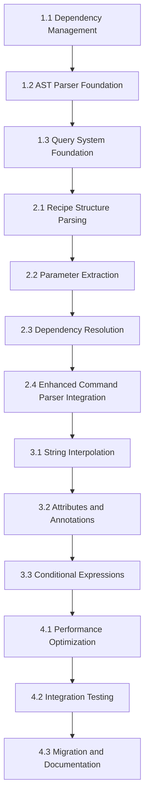

# Tree-sitter Grammar Parser Implementation Tasks

## Executive Summary

This document provides a comprehensive implementation plan for the AST-based Just parser using Tree-sitter. The implementation follows a hybrid strategy that combines reliable CLI-based recipe discovery with formal grammar parsing for maximum accuracy. The plan is structured into four major phases with clearly defined dependencies, deliverables, and acceptance criteria.

## Goaly Goal and Task IDs

### Goals
- **Goal 16**: Foundation & Infrastructure (Week 1)
- **Goal 17**: Core AST Implementation (Week 2)  
- **Goal 18**: Advanced Grammar Features (Week 3)
- **Goal 19**: Integration & Optimization (Week 4)

### Tasks by Goal
- **Goal 16 Tasks**: 129, 130, 131
- **Goal 17 Tasks**: 132, 133, 134, 135
- **Goal 18 Tasks**: 136, 137, 138
- **Goal 19 Tasks**: 139, 140, 141

### Cross-Goal Dependencies
Note: Goaly requires dependencies to be within the same goal. The following critical path dependencies span across goals and must be manually coordinated:

- **Task 132** (Recipe Structure Parsing) depends on **Task 131** (Query System Foundation)
- **Task 136** (String Interpolation) depends on **Task 135** (Enhanced Command Parser Integration)
- **Task 139** (Performance Optimization) depends on **Task 138** (Conditional Expressions)

These cross-goal dependencies represent the critical path and require completion of the previous goal before starting the dependent task in the next goal.

### Key Objectives
- Implement Tree-sitter AST parsing with 100% Just grammar coverage
- Maintain backward compatibility with existing `EnhancedJustfileParser`
- Achieve performance targets of 6-12ms overhead per recipe
- Provide robust three-tier fallback system (AST → Regex → Warning)
- Enable gradual migration with comprehensive testing

### Implementation Strategy
- **Phase 1**: Foundation and dependencies (Week 1)
- **Phase 2**: Core AST parsing implementation (Week 2)
- **Phase 3**: Advanced features and grammar support (Week 3)
- **Phase 4**: Integration, optimization, and migration (Week 4)

## Phase Breakdown

### Phase 1: Foundation (Week 1)
**Objective**: Establish the foundational infrastructure for Tree-sitter integration

#### 1.1 Dependency Management and Build Setup *(Goaly Task ID: 129)*
**Estimated Effort**: 1 day

**Subtasks**:
- Add Tree-sitter dependencies to `Cargo.toml`
- Configure build dependencies for C compilation
- Set up Tree-sitter-just grammar integration
- Create feature flag for AST parsing (`ast-parser`)

**Dependencies**: None

**Acceptance Criteria**:
- [ ] Project builds successfully with Tree-sitter dependencies
- [ ] Tree-sitter-just grammar loads without errors
- [ ] Feature flag toggles AST parser compilation
- [ ] All existing tests pass with new dependencies

**Deliverables**:
- Updated `Cargo.toml` with dependencies
- Build configuration for Tree-sitter
- Feature flag implementation

#### 1.2 AST Parser Foundation Structure *(Goaly Task ID: 130)*
**Estimated Effort**: 2 days

**Subtasks**:
- Create `src/parser/ast/` module structure
- Implement `ASTJustParser` struct with Tree-sitter integration
- Add parser initialization and basic error handling
- Create AST node traversal utilities

**Dependencies**: 1.1 (Dependency Management) - Task 129

**Acceptance Criteria**:
- [ ] `ASTJustParser` initializes Tree-sitter parser successfully
- [ ] Basic AST node traversal works for simple recipes
- [ ] Error handling covers Tree-sitter failures
- [ ] Parser can be reused across multiple recipe parses

**Deliverables**:
- `src/parser/ast/mod.rs` with base structures
- `src/parser/ast/parser.rs` with `ASTJustParser`
- `src/parser/ast/nodes.rs` with traversal utilities
- `src/parser/ast/errors.rs` with error types

#### 1.3 Query System Foundation *(Goaly Task ID: 131)*
**Estimated Effort**: 1 day

**Subtasks**:
- Define Tree-sitter query patterns for recipe metadata
- Implement query compilation and caching system
- Create query execution utilities
- Add query result processing helpers

**Dependencies**: 1.2 (AST Parser Foundation) - Task 130

**Acceptance Criteria**:
- [ ] Query patterns compile successfully for basic recipes
- [ ] Query cache improves performance on repeated parses
- [ ] Query results can be converted to recipe metadata
- [ ] Error handling covers query compilation failures

**Deliverables**:
- `src/parser/ast/queries.rs` with query patterns
- `src/parser/ast/cache.rs` with query caching
- Query execution and result processing utilities

### Phase 2: Core AST Parsing (Week 2)
**Objective**: Implement complete recipe metadata extraction using AST parsing

#### 2.1 Recipe Structure Parsing *(Goaly Task ID: 132)*
**Estimated Effort**: 2 days

**Subtasks**:
- Implement recipe name extraction from AST
- Add recipe body parsing and text extraction
- Create recipe line number and position tracking
- Add basic recipe validation

**Dependencies**: 1.3 (Query System Foundation) - Task 131 (cross-goal dependency)

**Acceptance Criteria**:
- [ ] Recipe names extracted correctly from all test cases
- [ ] Recipe bodies preserve formatting and content
- [ ] Line numbers accurately track recipe positions
- [ ] Validation catches malformed recipe structures

**Deliverables**:
- Recipe parsing implementation in `ASTJustParser`
- Recipe validation functions
- Test suite for recipe structure parsing

#### 2.2 Parameter Extraction and Processing *(Goaly Task ID: 133)*
**Estimated Effort**: 2 days

**Subtasks**:
- Implement parameter name and type extraction
- Add default value parsing with expression handling
- Create parameter description extraction from comments
- Handle variadic parameters and special parameter types

**Dependencies**: 2.1 (Recipe Structure Parsing) - Task 132

**Acceptance Criteria**:
- [ ] All parameter types parsed correctly (required, optional, variadic)
- [ ] Default values extracted with proper expression evaluation
- [ ] Parameter descriptions matched from adjacent comments
- [ ] Complex parameter syntax handled (e.g., `+args`)

**Deliverables**:
- Parameter parsing implementation
- Expression evaluation utilities
- Comment association logic
- Parameter test suite

#### 2.3 Dependency Resolution *(Goaly Task ID: 134)*
**Estimated Effort**: 1 day

**Subtasks**:
- Implement dependency name extraction
- Add dependency argument parsing
- Handle conditional dependencies
- Create dependency validation

**Dependencies**: 2.2 (Parameter Extraction) - Task 133

**Acceptance Criteria**:
- [ ] Simple dependencies parsed correctly
- [ ] Dependencies with arguments extracted properly
- [ ] Conditional dependencies handled appropriately
- [ ] Circular dependency detection implemented

**Deliverables**:
- Dependency parsing implementation
- Dependency validation logic
- Dependency test cases

#### 2.4 Enhanced Command Parser Integration *(Goaly Task ID: 135)*
**Estimated Effort**: 1 day

**Subtasks**:
- Create `EnhancedCommandParser` with AST integration
- Implement three-tier fallback system
- Add parsing metrics and diagnostics
- Integrate with existing CLI-based recipe discovery

**Dependencies**: 2.3 (Dependency Resolution) - Task 134

**Acceptance Criteria**:
- [ ] AST parsing attempted first for all recipes
- [ ] Fallback to regex parsing on AST failures
- [ ] Minimal task creation on total parsing failure
- [ ] Metrics track parsing method success rates

**Deliverables**:
- Enhanced `EnhancedCommandParser` implementation
- Fallback logic with error handling
- Parsing diagnostics and metrics
- Integration tests

### Phase 3: Advanced Grammar Support (Week 3)
**Objective**: Implement support for complex Just language constructs

#### 3.1 String Interpolation and Expressions *(Goaly Task ID: 136)*
**Estimated Effort**: 2 days

**Subtasks**:
- Implement string interpolation parsing (`"Hello {{name}}"`)
- Add expression evaluation for default values
- Handle nested interpolations and complex expressions
- Create string literal processing with escape sequences

**Dependencies**: 2.4 (Enhanced Command Parser Integration) - Task 135 (cross-goal dependency)

**Acceptance Criteria**:
- [ ] String interpolation parsed and preserved correctly
- [ ] Complex expressions in default values handled
- [ ] Escape sequences processed appropriately
- [ ] Multi-line strings with indentation preserved

**Deliverables**:
- String interpolation parsing logic
- Expression evaluation utilities
- String processing functions
- Expression and string test suite

#### 3.2 Attributes and Annotations *(Goaly Task ID: 137)*
**Estimated Effort**: 1 day

**Subtasks**:
- Implement attribute parsing (`[group('name')]`, `[private]`)
- Add annotation extraction and processing
- Handle attribute arguments and values
- Create attribute validation

**Dependencies**: 3.1 (String Interpolation) - Task 136

**Acceptance Criteria**:
- [ ] All attribute types parsed correctly
- [ ] Attribute arguments extracted properly
- [ ] Attribute validation prevents invalid combinations
- [ ] Attributes properly associated with recipes

**Deliverables**:
- Attribute parsing implementation
- Attribute validation logic
- Attribute test cases

#### 3.3 Conditional Expressions and Function Calls *(Goaly Task ID: 138)*
**Estimated Effort**: 2 days

**Subtasks**:
- Implement conditional expression parsing (`if condition { value }`)
- Add function call parsing (`env_var("VAR")`)
- Handle complex conditional logic
- Create function argument parsing

**Dependencies**: 3.2 (Attributes and Annotations) - Task 137

**Acceptance Criteria**:
- [ ] Conditional expressions parsed with all branches
- [ ] Function calls with arguments extracted correctly
- [ ] Nested conditions and function calls handled
- [ ] Expression evaluation maintains semantic meaning

**Deliverables**:
- Conditional expression parsing
- Function call extraction
- Complex expression handling
- Advanced grammar test suite

### Phase 4: Integration and Optimization (Week 4)
**Objective**: Complete integration with existing system and optimize performance

#### 4.1 Performance Optimization *(Goaly Task ID: 139)*
**Estimated Effort**: 2 days

**Subtasks**:
- Implement parser instance reuse across recipes
- Add query result caching for repeated patterns
- Optimize memory usage and allocation patterns
- Create performance benchmarking suite

**Dependencies**: 3.3 (Conditional Expressions) - Task 138 (cross-goal dependency)

**Acceptance Criteria**:
- [ ] Parser reuse reduces initialization overhead
- [ ] Query caching improves repeated parsing performance
- [ ] Memory usage remains within acceptable bounds
- [ ] Performance targets of 6-12ms per recipe achieved

**Deliverables**:
- Parser optimization implementation
- Caching mechanisms
- Memory management improvements
- Performance benchmark results

#### 4.2 Integration Testing and Validation *(Goaly Task ID: 140)*
**Estimated Effort**: 1 day

**Subtasks**:
- Test against all 99 existing project recipes
- Validate parser consistency across AST and regex methods
- Create comprehensive integration test suite
- Add real-world recipe validation

**Dependencies**: 4.1 (Performance Optimization) - Task 139

**Acceptance Criteria**:
- [ ] All 99 project recipes parse successfully
- [ ] AST and regex parsers produce consistent results
- [ ] Integration tests cover all parsing scenarios
- [ ] No regressions in existing functionality

**Deliverables**:
- Comprehensive integration test suite
- Recipe validation results
- Consistency verification tests
- Regression test coverage

#### 4.3 Migration and Documentation *(Goaly Task ID: 141)*
**Estimated Effort**: 1 day

**Subtasks**:
- Update `EnhancedJustfileParser` to use AST by default
- Create migration guide and usage documentation
- Add developer documentation for AST parser
- Implement graceful fallback for environments without Tree-sitter

**Dependencies**: 4.2 (Integration Testing) - Task 140

**Acceptance Criteria**:
- [ ] Migration path clearly documented
- [ ] AST parser enabled by default with fallback
- [ ] Developer documentation covers AST parser API
- [ ] Fallback gracefully handles Tree-sitter unavailability

**Deliverables**:
- Migration implementation
- User and developer documentation
- API documentation updates
- Migration validation tests

## Dependency Graph

## Critical Path

The critical path for the implementation is:
1. **1.1 → 1.2 → 1.3**: Foundation setup (4 days)
2. **2.1 → 2.2 → 2.3 → 2.4**: Core parsing (6 days)
3. **3.1 → 3.2 → 3.3**: Advanced features (5 days)
4. **4.1 → 4.2 → 4.3**: Integration and optimization (4 days)

**Total Critical Path**: 19 days (~4 weeks)

## Parallel Work Opportunities

### Week 1-2 Parallel Tasks
- Documentation writing can begin alongside foundation work
- Test case development can run parallel to implementation
- Performance benchmark preparation can start early

### Week 3-4 Parallel Tasks
- Integration testing can begin before all advanced features complete
- Documentation updates can run parallel to optimization work
- Migration planning can start before implementation completion

## Timeline Estimates

### Week 1: Foundation Phase
- **Days 1-2**: Dependency setup and AST parser foundation
- **Days 3-4**: Query system and basic parsing infrastructure
- **Day 5**: Foundation testing and validation

### Week 2: Core Implementation
- **Days 1-2**: Recipe structure and parameter parsing
- **Days 3-4**: Dependency resolution and command parser integration
- **Day 5**: Core functionality testing

### Week 3: Advanced Features
- **Days 1-2**: String interpolation and expression handling
- **Day 3**: Attributes and annotations
- **Days 4-5**: Conditional expressions and function calls

### Week 4: Integration and Deployment
- **Days 1-2**: Performance optimization and benchmarking
- **Day 3**: Integration testing with existing recipes
- **Days 4-5**: Migration, documentation, and final validation

## Quality Gates

### End of Phase 1
- [ ] All Tree-sitter dependencies integrated successfully
- [ ] Basic AST parsing functional for simple recipes
- [ ] Error handling covers fundamental failure cases
- [ ] No regressions in existing functionality

### End of Phase 2
- [ ] Complete recipe metadata extraction working
- [ ] Three-tier fallback system operational
- [ ] Parsing metrics and diagnostics implemented
- [ ] Core functionality matches existing parser output

### End of Phase 3
- [ ] All major Just language constructs supported
- [ ] Complex recipes parse correctly
- [ ] Advanced features maintain parsing accuracy
- [ ] Feature parity with current enhanced parser

### End of Phase 4
- [ ] Performance targets achieved (6-12ms per recipe)
- [ ] All 99 project recipes parse successfully
- [ ] Migration path validated and documented
- [ ] Production-ready implementation deployed

## Risk Mitigation

### High-Risk Tasks

#### 1.1 Dependency Management
**Risk**: Tree-sitter integration complexity
**Mitigation**: 
- Research Tree-sitter Rust integration thoroughly
- Test with minimal example before full integration
- Have fallback plan to vendor grammar if needed

#### 3.1 String Interpolation
**Risk**: Complex expression parsing accuracy
**Mitigation**:
- Start with simple interpolation patterns
- Build comprehensive test suite from Just documentation
- Validate against official Just parser behavior

#### 4.1 Performance Optimization
**Risk**: Performance targets not achievable
**Mitigation**:
- Benchmark early and frequently
- Identify optimization opportunities proactively
- Have fallback to regex-only parsing if needed

### Medium-Risk Tasks

#### 2.4 Enhanced Command Parser Integration
**Risk**: Fallback system complexity
**Mitigation**:
- Design clear interfaces between parsing methods
- Test fallback triggers thoroughly
- Ensure graceful degradation

#### 4.2 Integration Testing
**Risk**: Compatibility issues with existing recipes
**Mitigation**:
- Test incrementally with growing recipe sets
- Maintain detailed compatibility matrix
- Fix issues immediately upon discovery

## Resource Requirements

### Skills Needed
- **Rust Development**: Advanced knowledge of Rust syntax and patterns
- **Tree-sitter Experience**: Understanding of Tree-sitter concepts and APIs
- **Grammar Knowledge**: Familiarity with formal grammar parsing
- **Just Language**: Deep understanding of Just syntax and features

### Tools and Dependencies
- **Development Environment**: Rust toolchain with Tree-sitter support
- **Tree-sitter CLI**: For grammar testing and development
- **Benchmarking Tools**: For performance measurement and optimization
- **Testing Infrastructure**: Comprehensive test suite for validation

### External Dependencies
- **tree-sitter-just Grammar**: Maintained by community, may need updates
- **Tree-sitter Library**: Stable but evolving C library
- **Just CLI**: Must remain available for recipe discovery

## Contingency Plans

### Grammar Maintenance Issues
- **Monitor**: Track Just and tree-sitter-just repository updates
- **Contribute**: Participate in grammar maintenance if needed
- **Fork**: Maintain internal fork if community support lapses
- **Fallback**: Regex parsing remains as reliable backup

### Performance Issues
- **Optimization**: Multiple optimization strategies identified
- **Caching**: Implement aggressive caching if needed
- **Lazy Loading**: Parse recipes only when accessed
- **Hybrid Mode**: Use AST parsing only for complex recipes

### Integration Complexity
- **Incremental Rollout**: Enable AST parsing gradually
- **Feature Flags**: Allow runtime switching between parsers
- **Compatibility Mode**: Maintain regex parser indefinitely if needed
- **Rollback Plan**: Quick rollback to enhanced parser if issues arise

## Success Metrics

### Functional Metrics
- **Recipe Coverage**: 100% of existing recipes parse successfully
- **Grammar Coverage**: All major Just language constructs supported
- **Accuracy**: AST parsing matches or exceeds regex parsing accuracy
- **Reliability**: Three-tier fallback ensures no recipe loss

### Performance Metrics
- **Parsing Speed**: 6-12ms per recipe achieved consistently
- **Memory Usage**: No significant increase in memory footprint
- **Startup Time**: No noticeable impact on application startup
- **Throughput**: Handle 99 recipes in under 1.5 seconds

### Quality Metrics
- **Test Coverage**: >95% code coverage for AST parser components
- **Error Handling**: All failure modes handled gracefully
- **Documentation**: Complete API and usage documentation
- **Maintainability**: Clean, well-structured code with good separation of concerns

## Conclusion

This implementation plan provides a structured approach to implementing Tree-sitter AST-based parsing for just-mcp. The phased approach allows for incremental development and validation, while the comprehensive task breakdown ensures all aspects of the implementation are considered.

The plan balances ambitious goals (formal grammar parsing) with practical constraints (backward compatibility, performance requirements). The robust fallback system ensures that the implementation improves parsing accuracy without sacrificing the reliability that makes just-mcp effective.

Key success factors:
1. **Incremental Implementation**: Build and test incrementally to catch issues early
2. **Comprehensive Testing**: Validate against existing recipes throughout development
3. **Performance Focus**: Monitor and optimize performance from the beginning
4. **Fallback Strategy**: Maintain reliable fallback to ensure no functionality loss
5. **Documentation**: Keep documentation current to support future maintenance

The timeline is aggressive but achievable with focused effort, and the risk mitigation strategies provide clear paths forward when challenges arise.